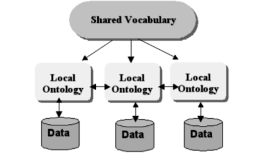

# Introduction

* Cross-community data sharing is crucial: Defense/Intelligence (DoD/IC) and civilian sectors increasingly rely on each other's geospatial data for disaster response and emergency management.
* Interoperability challenges: Significant hurdles exist in integrating data due to varying data sources, models, and updating frequencies.
* Semantic heterogeneity is a major obstacle: Different organizations use different ontologies and standards to represent data, making it difficult to understand and combine information.

**Need for a shared ontology:** A common "reference ontology" is required to bridge the semantic gap and enable seamless data exchange between diverse organizations.

**In essence:** The text highlights the critical need for improved interoperability between geospatial data systems used by different sectors to effectively respond to disasters. This requires addressing the semantic challenges arising from diverse data representations.

{ width=100% }

## **Potential Enhancement:**

* "A successful shared ontology will enable more efficient and effective disaster response by facilitating seamless data sharing and analysis across diverse organizations."