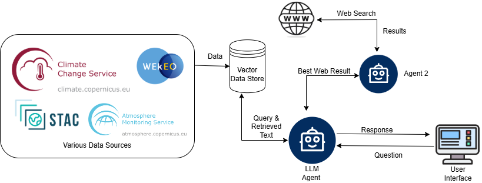

# Methodology
Steps to implement the project:

1. Data curation and integration.
2. Assistant development for NLP-enabled querying.
3. Incorporation of Open Geospatial standards.

The below figure summarizes the workflow.
{ width=100% }
 